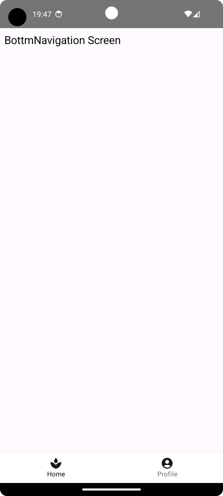

# DroidKaigi2023JetpackComposeUI

DroidKaigi 2023での発表「よく見るあのUIをJetpack Composeで実装する方法〇選」のコードを公開しているリポジトリです。
https://2023.droidkaigi.jp/timetable/495090/

## 1. ローディング

プログレスインジケータを使用し、読み込み中・進行中であることを示す

## 2. ボトムナビゲーション

画面を切り替えるために下部に配置するUI

## 3. ボトムシート

スクリーンの下の縁からスライドアップして、追加のコンテンツを表示する

## 4. アコーディオン

タップで開閉し、コンテンツの表示・非表示を切り替えるUI

## 5. カルーセル

画像などのコンテンツをスライドして表示させるUI

## 6. クレジットカード番号入力

区切り文字を入れながら14桁〜16桁の数字を入力する

## 7. 固定ヘッダー 

スクロールによって一定の位置まで達したときに、その位置にくっつくように固定されるヘッダー（StickyHeader）

## 8. 特定位置へのスクロール

テキストをタップするとあらかじめ決めておいたComposableの位置へスクロールする

## 9. もっと見る

長いテキストを省略し、末尾に「もっと見る」というテキストをつけて展開する（Expandable Text）

